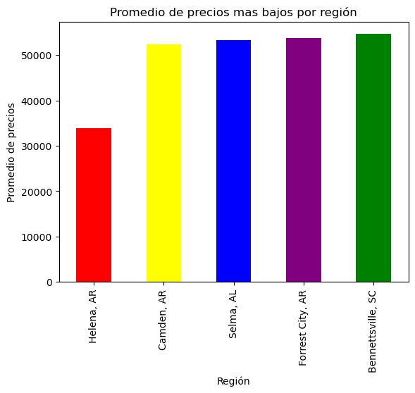

<h1> Análisis de los precios de viviendas en el área metropolitana de Nueva York </h1>

<h3>Descripción:</h3>
<la>Utilizar técnicas de análisis de datos para investigar los precios de viviendas en el área metropolitana de Nueva York. El objetivo es obtener los cinco (5) promedios de venta mas altos y los cinco (5) promedios de venta mas bajos.</la>

<h3>Pasos:</h3>

<li>Descargar los datos de la fuente Zillow Research (https://www.zillow.com/research/data/)</li>
<li>Limpieza y preparación de los datos</li>
<li>Análisis exploratorio de los datos</li>
<li>Creación de gráficos y visualizaciones para presentar los hallazgos</li>
<li>Identificar promedios en los precios de las viviendas</li>
<li>Crear un informe de conclusiones y recomendaciones para inversionistas inmobiliarios.</li>
<li>Herramientas y tecnologías utilizadas: Python, Pandas, Matplotlib, Jupyter notebook</li>

<h4>Este segmento de código importa dos librerías importantes para el análisis de datos y la visualización de gráficos en Python: pandas y matplotlib. Pandas es una librería de código abierto que proporciona estructuras de datos y herramientas de análisis de datos fáciles de usar, mientras que matplotlib es una librería de código abierto que se utiliza para crear gráficos estáticos, animaciones y visualizaciones en 2D y 3D en Python. Estas librerías son ampliamente utilizadas en el análisis de datos y la visualización de gráficos en Python.</h4>


```python
# importamos la librería pandas
import pandas as pd

# importamos la librería matplotlib
import matplotlib.pyplot as plt

```

<h4>Este segmento de código utiliza el paquete pandas para leer un archivo CSV (Comma Separated Values) y guardarlo en un DataFrame llamado 'df'. El método 'pd.read_csv' se utiliza para leer un archivo CSV y convertirlo en un DataFrame. El nombre del archivo se pasa como un argumento al método 'pd.read_csv', en este caso el nombre del archivo es "Datos.csv".</h4>

<h4>Una vez que el archivo se ha leído y convertido en un DataFrame, se imprime el DataFrame 'df' para verificar que los datos se hayan cargado correctamente.</h4>


```python
# utilizamos el método 'pd.read_csv' para leer un archivo CSV y guardarlo en un DataFrame 'df'
df = pd.read_csv("Datos.csv")

# imprimimos el DataFrame 'df' para verificar que los datos se hayan cargado correctamente
df
```


<div>
<style scoped>
    .dataframe tbody tr th:only-of-type {
        vertical-align: middle;
    }

    .dataframe tbody tr th {
        vertical-align: top;
    }

    .dataframe thead th {
        text-align: right;
    }
</style>
<table border="1" class="dataframe">
  <thead>
    <tr style="text-align: right;">
      <th></th>
      <th>RegionID</th>
      <th>SizeRank</th>
      <th>RegionName</th>
      <th>RegionType</th>
      <th>StateName</th>
      <th>2000-01-31</th>
      <th>2000-02-29</th>
      <th>2000-03-31</th>
      <th>2000-04-30</th>
      <th>2000-05-31</th>
      <th>...</th>
      <th>2022-03-31</th>
      <th>2022-04-30</th>
      <th>2022-05-31</th>
      <th>2022-06-30</th>
      <th>2022-07-31</th>
      <th>2022-08-31</th>
      <th>2022-09-30</th>
      <th>2022-10-31</th>
      <th>2022-11-30</th>
      <th>2022-12-31</th>
    </tr>
  </thead>
  <tbody>
    <tr>
      <th>0</th>
      <td>102001</td>
      <td>0</td>
      <td>United States</td>
      <td>country</td>
      <td>NaN</td>
      <td>127845.0</td>
      <td>128190.0</td>
      <td>128554.0</td>
      <td>129295.0</td>
      <td>130042.0</td>
      <td>...</td>
      <td>337752.0</td>
      <td>343294.0</td>
      <td>348315.0</td>
      <td>352484.0</td>
      <td>354884.0</td>
      <td>355924.0</td>
      <td>356279.0</td>
      <td>356785.0</td>
      <td>357296.0</td>
      <td>357319.0</td>
    </tr>
    <tr>
      <th>1</th>
      <td>394913</td>
      <td>1</td>
      <td>New York, NY</td>
      <td>msa</td>
      <td>NY</td>
      <td>222885.0</td>
      <td>224217.0</td>
      <td>225415.0</td>
      <td>227774.0</td>
      <td>229970.0</td>
      <td>...</td>
      <td>587159.0</td>
      <td>594234.0</td>
      <td>601691.0</td>
      <td>607653.0</td>
      <td>611940.0</td>
      <td>614208.0</td>
      <td>615185.0</td>
      <td>615662.0</td>
      <td>616681.0</td>
      <td>617849.0</td>
    </tr>
    <tr>
      <th>2</th>
      <td>753899</td>
      <td>2</td>
      <td>Los Angeles, CA</td>
      <td>msa</td>
      <td>CA</td>
      <td>230273.0</td>
      <td>231075.0</td>
      <td>232303.0</td>
      <td>234638.0</td>
      <td>237142.0</td>
      <td>...</td>
      <td>904811.0</td>
      <td>923996.0</td>
      <td>940540.0</td>
      <td>941881.0</td>
      <td>938738.0</td>
      <td>924623.0</td>
      <td>914991.0</td>
      <td>905397.0</td>
      <td>900776.0</td>
      <td>897894.0</td>
    </tr>
    <tr>
      <th>3</th>
      <td>394463</td>
      <td>3</td>
      <td>Chicago, IL</td>
      <td>msa</td>
      <td>IL</td>
      <td>167528.0</td>
      <td>167923.0</td>
      <td>168434.0</td>
      <td>169458.0</td>
      <td>170543.0</td>
      <td>...</td>
      <td>295653.0</td>
      <td>299069.0</td>
      <td>302975.0</td>
      <td>305916.0</td>
      <td>307737.0</td>
      <td>308055.0</td>
      <td>308352.0</td>
      <td>308969.0</td>
      <td>309456.0</td>
      <td>308959.0</td>
    </tr>
    <tr>
      <th>4</th>
      <td>394514</td>
      <td>4</td>
      <td>Dallas, TX</td>
      <td>msa</td>
      <td>TX</td>
      <td>128766.0</td>
      <td>128869.0</td>
      <td>128955.0</td>
      <td>129164.0</td>
      <td>129383.0</td>
      <td>...</td>
      <td>363776.0</td>
      <td>373139.0</td>
      <td>381724.0</td>
      <td>389176.0</td>
      <td>391350.0</td>
      <td>390417.0</td>
      <td>388728.0</td>
      <td>388858.0</td>
      <td>388704.0</td>
      <td>386853.0</td>
    </tr>
    <tr>
      <th>...</th>
      <td>...</td>
      <td>...</td>
      <td>...</td>
      <td>...</td>
      <td>...</td>
      <td>...</td>
      <td>...</td>
      <td>...</td>
      <td>...</td>
      <td>...</td>
      <td>...</td>
      <td>...</td>
      <td>...</td>
      <td>...</td>
      <td>...</td>
      <td>...</td>
      <td>...</td>
      <td>...</td>
      <td>...</td>
      <td>...</td>
      <td>...</td>
    </tr>
    <tr>
      <th>888</th>
      <td>753929</td>
      <td>923</td>
      <td>Zapata, TX</td>
      <td>msa</td>
      <td>TX</td>
      <td>NaN</td>
      <td>NaN</td>
      <td>NaN</td>
      <td>NaN</td>
      <td>NaN</td>
      <td>...</td>
      <td>122478.0</td>
      <td>122759.0</td>
      <td>122752.0</td>
      <td>123793.0</td>
      <td>125023.0</td>
      <td>126537.0</td>
      <td>127550.0</td>
      <td>128146.0</td>
      <td>128088.0</td>
      <td>127332.0</td>
    </tr>
    <tr>
      <th>889</th>
      <td>394743</td>
      <td>924</td>
      <td>Ketchikan, AK</td>
      <td>msa</td>
      <td>AK</td>
      <td>NaN</td>
      <td>NaN</td>
      <td>NaN</td>
      <td>NaN</td>
      <td>NaN</td>
      <td>...</td>
      <td>375894.0</td>
      <td>376390.0</td>
      <td>378276.0</td>
      <td>381933.0</td>
      <td>385269.0</td>
      <td>388616.0</td>
      <td>390850.0</td>
      <td>393137.0</td>
      <td>393589.0</td>
      <td>393453.0</td>
    </tr>
    <tr>
      <th>890</th>
      <td>753874</td>
      <td>925</td>
      <td>Craig, CO</td>
      <td>msa</td>
      <td>CO</td>
      <td>101674.0</td>
      <td>102043.0</td>
      <td>102669.0</td>
      <td>103412.0</td>
      <td>104179.0</td>
      <td>...</td>
      <td>271945.0</td>
      <td>272106.0</td>
      <td>273108.0</td>
      <td>277250.0</td>
      <td>281998.0</td>
      <td>287093.0</td>
      <td>289368.0</td>
      <td>291121.0</td>
      <td>285704.0</td>
      <td>279206.0</td>
    </tr>
    <tr>
      <th>891</th>
      <td>394767</td>
      <td>926</td>
      <td>Lamesa, TX</td>
      <td>msa</td>
      <td>TX</td>
      <td>NaN</td>
      <td>NaN</td>
      <td>NaN</td>
      <td>NaN</td>
      <td>NaN</td>
      <td>...</td>
      <td>106786.0</td>
      <td>107915.0</td>
      <td>109081.0</td>
      <td>110737.0</td>
      <td>112532.0</td>
      <td>113743.0</td>
      <td>114038.0</td>
      <td>114339.0</td>
      <td>113534.0</td>
      <td>112769.0</td>
    </tr>
    <tr>
      <th>892</th>
      <td>395188</td>
      <td>927</td>
      <td>Vernon, TX</td>
      <td>msa</td>
      <td>TX</td>
      <td>NaN</td>
      <td>NaN</td>
      <td>NaN</td>
      <td>NaN</td>
      <td>NaN</td>
      <td>...</td>
      <td>92643.0</td>
      <td>93333.0</td>
      <td>93636.0</td>
      <td>94871.0</td>
      <td>96356.0</td>
      <td>97922.0</td>
      <td>98998.0</td>
      <td>99648.0</td>
      <td>99329.0</td>
      <td>98772.0</td>
    </tr>
  </tbody>
</table>
<p>893 rows × 281 columns</p>
</div>


<h4>Este segmento de código utiliza el DataFrame 'df' para generar un resumen estadístico y mostrar información sobre la cantidad de valores no nulos y la cantidad de valores nulos en cada columna del DataFrame 'df'.</h4>


```python
# generamos un resumen estadístico del DataFrame 'df' y lo guardamos en un nuevo DataFrame 'df1'
df1 = df.describe()

# seleccionamos la fila "count" del DataFrame 'df1' y la imprimimos
print(df1.loc["count",:])

# detectamos los valores nulos en el DataFrame 'df' y contamos cuántos hay en cada columna
# el resultado se imprime
print(df.isnull().sum())

```

    RegionID      893.0
    SizeRank      893.0
    2000-01-31    436.0
    2000-02-29    437.0
    2000-03-31    438.0
                  ...  
    2022-08-31    893.0
    2022-09-30    892.0
    2022-10-31    893.0
    2022-11-30    891.0
    2022-12-31    891.0
    Name: count, Length: 278, dtype: float64
    RegionID      0
    SizeRank      0
    RegionName    0
    RegionType    0
    StateName     1
                 ..
    2022-08-31    0
    2022-09-30    1
    2022-10-31    0
    2022-11-30    2
    2022-12-31    2
    Length: 281, dtype: int64
    

<h4>Este segmento de código recorre cada fila del DataFrame 'df' y reemplaza los valores nulos con el promedio de esa fila.</h4>


```python
# recorremos cada fila del DataFrame 'df'
for x in range(len(df)):
    # calculamos el promedio de cada fila utilizando el método 'loc' para seleccionar todas las columnas desde "2000-01-31" hasta el final 
    # y el método 'mean()' para calcular el promedio
    mean_row = df.loc[x, "2000-01-31":].mean()    
    # reemplazamos los valores nulos de la fila con el promedio calculado anteriormente
    df.loc[x, :] = df.loc[x, :].fillna(mean_row)
```

<h4>Este segmento de código utiliza el DataFrame 'df' para generar un resumen estadístico y mostrar información sobre la cantidad de valores no nulos y la cantidad de valores nulos en cada columna del DataFrame 'df' y verificar si se ajustaron.</h4>


```python
# generamos un resumen estadístico del DataFrame 'df' y lo guardamos en un nuevo DataFrame 'df1'
df1 = df.describe()

# seleccionamos la fila "count" del DataFrame 'df1' y la imprimimos
print(df1.loc["count",:])

# detectamos los valores nulos en el DataFrame 'df' y contamos cuántos hay en cada columna
# el resultado se imprime
print(df.isnull().sum())
```

    RegionID      893.0
    SizeRank      893.0
    2000-01-31    893.0
    2000-02-29    893.0
    2000-03-31    893.0
                  ...  
    2022-08-31    893.0
    2022-09-30    893.0
    2022-10-31    893.0
    2022-11-30    893.0
    2022-12-31    893.0
    Name: count, Length: 278, dtype: float64
    RegionID      0
    SizeRank      0
    RegionName    0
    RegionType    0
    StateName     0
                 ..
    2022-08-31    0
    2022-09-30    0
    2022-10-31    0
    2022-11-30    0
    2022-12-31    0
    Length: 281, dtype: int64
    

<h4>Este  segmento de código utiliza el DataFrame 'df' para calcular el promedio de los precios de las viviendas para cada región, crear un nuevo DataFrame con esos valores y ordenarlo en orden descendiente para seleccionar las 5 regiones con el promedio más alto.</h4>


```python
# seleccionamos la columna "RegionName" del DataFrame 'df' y la almacenamos en una lista
Region_name = list(df.loc[:,"RegionName"])

# creamos una lista vacía para almacenar los promedios de los precios de las viviendas
means = []

# recorremos cada fila del DataFrame 'df'
for x in range(len(df)):
    
    # utilizamos el método 'loc' para seleccionar todas las columnas desde "2000-01-31" hasta el final y calculamos el promedio
    # convertimos el resultado a entero y lo añadimos a la lista 'means'
    means.append(int(df.loc[x, "2000-01-31":].mean()))

# creamos un diccionario con dos claves: "RegionName" y "PriceMean"
# asignamos como valor para la clave "RegionName" la lista "Region_name" y como valor para la clave "PriceMean" la lista "means"
diccionario = {"RegionName":Region_name, "PriceMean":means}

# creamos un nuevo DataFrame llamado 'df2' utilizando el diccionario creado anteriormente
df2 = pd.DataFrame(diccionario)

# ordenamos el DataFrame 'df2' en orden descendiente utilizando el método 'sort_values' y seleccionamos las primeras 5 filas con 'head(5)'
# guardamos el resultado en un nuevo DataFrame 'df3'
df3 = df2.sort_values(by='PriceMean', ascending=False).head(5)

# imprimimos el DataFrame 'df3'
df3

```


<div>
<style scoped>
    .dataframe tbody tr th:only-of-type {
        vertical-align: middle;
    }

    .dataframe tbody tr th {
        vertical-align: top;
    }

    .dataframe thead th {
        text-align: right;
    }
</style>
<table border="1" class="dataframe">
  <thead>
    <tr style="text-align: right;">
      <th></th>
      <th>RegionName</th>
      <th>PriceMean</th>
    </tr>
  </thead>
  <tbody>
    <tr>
      <th>35</th>
      <td>San Jose, CA</td>
      <td>843523</td>
    </tr>
    <tr>
      <th>12</th>
      <td>San Francisco, CA</td>
      <td>773532</td>
    </tr>
    <tr>
      <th>466</th>
      <td>Key West, FL</td>
      <td>744704</td>
    </tr>
    <tr>
      <th>877</th>
      <td>Vineyard Haven, MA</td>
      <td>733018</td>
    </tr>
    <tr>
      <th>180</th>
      <td>Santa Cruz, CA</td>
      <td>688042</td>
    </tr>
  </tbody>
</table>
</div>


<h4>Este segmento de código utiliza la librería matplotlib para crear un gráfico de barras con el DataFrame 'df3', donde en el eje x se encuentra la columna 'RegionName' y en el eje y se encuentra la columna 'PriceMean', se agrega el título "Promedio de precios mas altos por región" y las etiquetas "Región" y "Promedio de precios" al eje x e y respectivamente.</h4>


```python
colores = ['red', 'yellow', 'blue', 'purple', 'green']

# utilizamos el método 'plot' con el argumento kind='bar' para crear un gráfico de barras
df3.plot(x='RegionName', y='PriceMean', kind='bar', legend=False, color=colores)

# agregamos título y etiquetas a los ejes
plt.title("Promedio de precios mas altos por región")
plt.xlabel("Región")
plt.ylabel("Promedio de precios")

# mostramos el gráfico
plt.show()
```


    

    


<h4>Este segmento de código utiliza el paquete pandas para ordenar un DataFrame llamado 'df2' en orden ascendente utilizando la columna 'Mean' como criterio de ordenamiento, luego selecciona las primeras 5 filas del DataFrame ordenado y guarda el resultado en un nuevo DataFrame llamado 'df4' y finalmente se imprime el DataFrame 'df4' para mostrar las primeras 5 filas del DataFrame 'df2' ordenadas de manera ascendente utilizando la columna 'Mean' como criterio de ordenamiento.</h4>


```python
# ordenamos el DataFrame 'df2' en orden ascendente utilizando la columna 'Mean' como criterio de ordenamiento
df4 = df2.sort_values(by='PriceMean', ascending=True)

# seleccionamos las primeras 5 filas del DataFrame ordenado
df4 = df4.head(5)

# imprimimos el DataFrame 'df4' para mostrar las primeras 5 filas del DataFrame 'df2' ordenadas de manera ascendente utilizando la columna 'Mean' como criterio de ordenamiento
print(df4)
```

                RegionName  PriceMean
    878         Helena, AR      33868
    804         Camden, AR      52352
    731          Selma, AL      53313
    834   Forrest City, AR      53808
    823  Bennettsville, SC      54638
    

<h4>Este segmento de código utiliza la librería matplotlib para crear un gráfico de barras con el DataFrame 'df4', donde en el eje x se encuentra la columna 'RegionName' y en el eje y se encuentra la columna 'PriceMean', se agrega el título "Promedio de precios mas altos por región" y las etiquetas "Región" y "Promedio de precios" al eje x e y respectivamente.</h4>


```python
colores = ['red', 'yellow', 'blue', 'purple', 'green']

# utilizamos el método 'plot' con el argumento kind='bar' para crear un gráfico de barras
df4.plot(x='RegionName', y='PriceMean', kind='bar', legend=False, color=colores)

# agregamos título y etiquetas a los ejes
plt.title("Promedio de precios mas bajos por región")
plt.xlabel("Región")
plt.ylabel("Promedio de precios")

# mostramos el gráfico
plt.show()
```


    

    


<h4>Este segmento de código guarda los DataFrames 'df3' y 'df4' en archivos CSV llamados "Promedio_Precios_Altos_Por_Region.csv" y "Promedio_Precios_Bajos_Por_Region.csv" respectivamente, los índices no son guardados en los archivos CSV.</h4>


```python
df3.to_csv("Promedio_Precios_Altos_Por_Region.csv", index=False)
df4.to_csv("Promedio_Precios_Bajos_Por_Region.csv", index=False)
```
